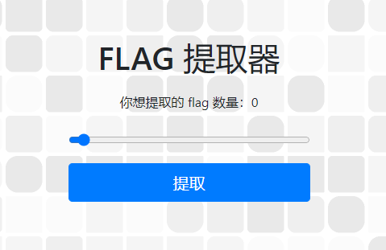
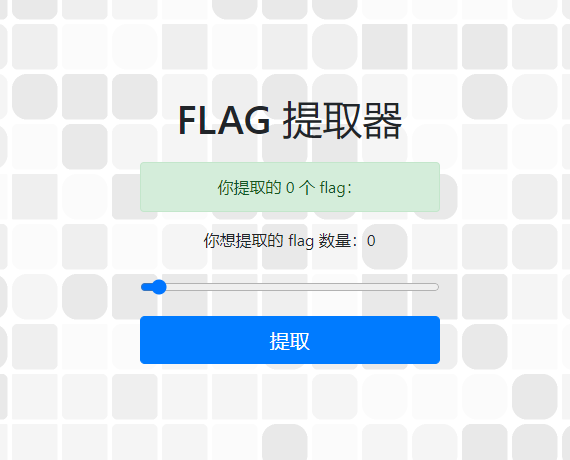
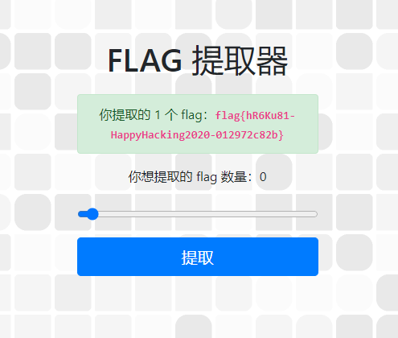
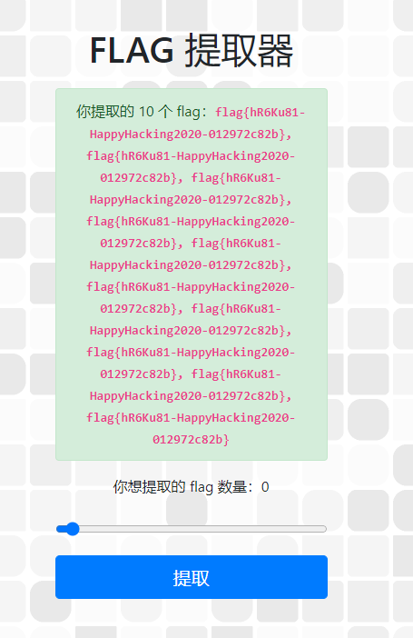
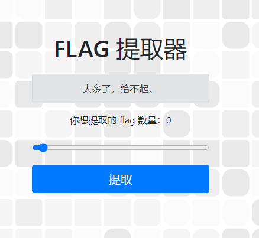
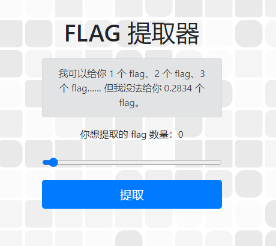

# 签到

先看题目：

> 谢邀，利益相关：老签到出题人了。
>
> 今年出题组的要求是「来参加我们比赛的同学很多都是初学者，我们的签到题要清晰明确一点，让同学们轻松签到。」
>
> 我完全明白了，签到题就是送 flag，送就送，我最会送了.jpg
>
> 首先写好题目介绍：**「你需要点击下面蓝色的 “打开/下载题目” 按钮，在打开的网页上获取到形如 `flag{...}` 的 flag，回到本页面，将其完整填写到下面的文本框中，并点击灰色的 “提交” 按钮即可完成本题。」**
>
> 然后写一个 flag 提取器，选手要多少个 flag，我就给多少个 flag，绿色背景，红色加粗，显眼的位置，标准的格式，这都不叫送，那还有什么叫做送。
>
> 点击 **「打开/下载题目」** 按钮，打开 flag 提取器，获取第一个 flag 吧！

打开链接`http://202.38.93.111:10000/`：

点一下“提取”，跳转到`http://202.38.93.111:10000/?number=0`：

修改url为`http://202.38.93.111:10000/?number=1`，得到flag `flag{hR6Ku81-HappyHacking2020-012972c82b}`：

一些彩蛋：

1. 将number改为复数，`http://202.38.93.111:10000/?number=10`，会得到复数个相同的flag：

2. 将number改成一个特别大的数，`http://202.38.93.111:10000/?number=10000000000000`：

3. 拖动滑块，发现只能拖到整数。将number改成一个非整数，`http://202.38.93.111:10000/?number=0.2834`：

   