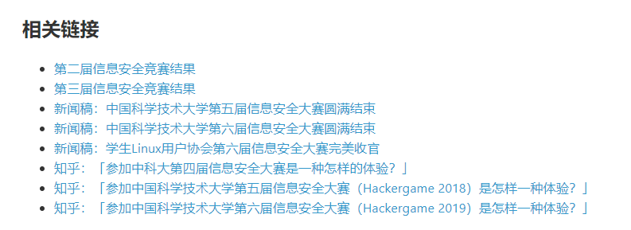

# 猫咪问答++

题面：

> 在科大西区的研究生食堂旁边，有块水泥石板盛产肥猫。 每一个晴朗的中午，其上都会有花花白白的猫咪慵懒地晒着太阳。 而许多吃完午饭的同学，也可以趁此良机大肆撸猫。
>
> 但是突然从某一天起，水泥石板上多了一只猫首猫身的动物，拦住前来撸猫的同学，用它精心准备好的谜语考验他们。 只有全部答对了才可以撸猫，如果不小心答错了它就会炸毛给你看。
>
> 为了让每日撸猫活动恢复正轨，热心的 LUG 协会同学把这些谜题放到了这里。 如果你能答对所有的谜题，就会有 flag 作为奖励。
>
> 提示：正如撸猫不必亲自到现场，**解出谜题也不需要是科大在校学生**。解题遇到困难？你可以参考 [2018 年猫咪问答题解](https://github.com/ustclug/hackergame2018-writeups/blob/master/official/ustcquiz/README.md)。


## 第一问：

> 以下编程语言、软件或组织对应标志是哺乳动物的有几个？
> Docker，Golang，Python，Plan 9，PHP，GNU，LLVM，Swift，Perl，GitHub，TortoiseSVN，FireFox，MySQL，PostgreSQL，MariaDB，Linux，OpenBSD，FreeDOS，Apache Tomcat，Squid，openSUSE，Kali，Xfce.
> 提示：学术上一般认为龙不属于哺乳动物。

太麻烦先跳过，留给之后暴力。


## 第二问

> 第一个以信鸽为载体的 IP 网络标准的 RFC 文档中推荐使用的 MTU (Maximum Transmission Unit) 是多少毫克？
> 提示：咕咕咕，咕咕咕。

百度`信鸽 RFC`，找到一篇报道： https://www.sohu.com/a/309403082_354973


然后查`RFC 2549`，找到 http://www.faqs.org/rfcs/rfc2549.html ， 有提及`RFC 1149`：


点进 http://www.faqs.org/rfcs/rfc1149.html ，可以找到MTU为256 mg。


答案为`256`。


## 第三问

> USTC Linux 用户协会在 2019 年 9 月 21 日自由软件日活动中介绍的开源游戏的名称共有几个字母？
> 提示：活动记录会在哪里？

去LUG的官网翻 https://lug.ustc.edu.cn/wiki/lug/events/ ，找到9月21日：


在ftp里找到当时的slides： https://ftp.lug.ustc.edu.cn/%E6%B4%BB%E5%8A%A8/2019.09.21_SFD/slides/%E9%97%AA%E7%94%B5%E6%BC%94%E8%AE%B2/Teeworlds/teeworlds.pdf


答案为`9`。


## 第四问

> 中国科学技术大学西校区图书馆正前方（西南方向） 50 米 L 型灌木处共有几个连通的划线停车位？
> 提示：建议身临其境。

直接上百度街景：


答案为`9`。


## 第五问

> 中国科学技术大学第六届信息安全大赛所有人合计提交了多少次 flag？
> 提示：是一个非负整数。

直接翻首页新闻稿 https://lug.ustc.edu.cn/news/2019/12/hackergame-2019/：




答案为`17098`。


## 回过头做第一问

用py暴力遍历一下（[code](cat.py)）：

```python
import requests as r
import re

def main():
    url = 'http://202.38.93.111:10001/'
    payload = {'q1': 0, 'q2': 256, 'q3': 9, 'q4': 9, 'q5': 17098}
    headers = {'Cookie': 'cooooooookie'}
    
    for i in range(1, 24):
        payload['q1'] = i
        _ = r.post(url=url, data=payload, headers=headers).text
        
        try:
            rst = re.findall(r'<div class="alert alert-secondary" role="alert">((?:.|\n)*?)</div>', _)[0]
        except IndexError:
            print(re.findall(r'(flag{.*?})', _)[0])

if __name__ == '__main__':
    main()

```

拿到flag：`flag{b4a31f2a_G00G1e_1s_y0ur_fr13nd_f15e9dea84}`。