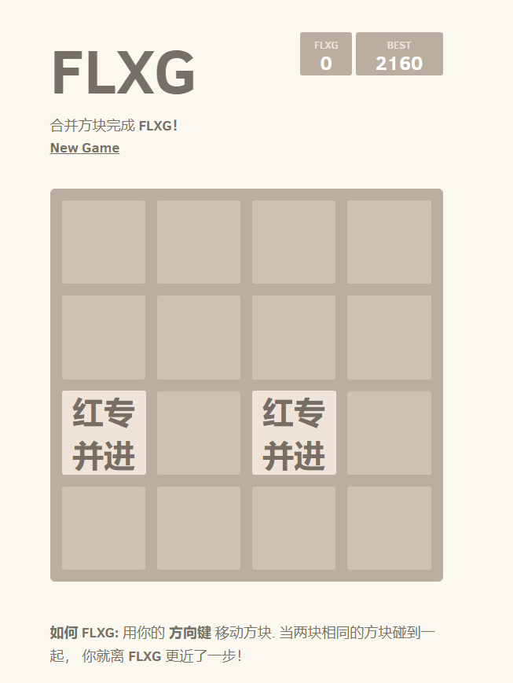

# 2048

题面：

> > 路漫漫其修远兮，FLXG 永不放弃！
>
> 要实现 FLXG，你需要过人的智慧，顽强的意志，和命运的眷属。只有在 2048 的世界里证明自己拥有这些宝贵的品质，实现「大成功」，你才有资格扛起 FLXG 的大旗。


点进去长这样：




~~我是不会说我真的玩了10分钟的。（最后果不其然地菜死了）~~


然后审查元素，翻每个js，翻到`html_actuator.js`，发现一段：

```js
HTMLActuator.prototype.message = function (won) {
  var type    = won ? "game-won" : "game-over";
  var message = won ? "FLXG 大成功！" : "FLXG 永不放弃！";

  var url;
  if (won) {
    url = "/getflxg?my_favorite_fruit=" + ('b'+'a'+ +'a'+'a').toLowerCase();
  } else {
    url = "/getflxg?my_favorite_fruit=";
  }

  let request = new XMLHttpRequest();
  request.open('GET', url);
  request.responseType = 'text';

  request.onload = function() {
    document.getElementById("game-message-extra").innerHTML = request.response;
  };

  request.send();

  this.messageContainer.classList.add(type);
  this.messageContainer.getElementsByTagName("p")[0].textContent = message;

  this.clearContainer(this.sharingContainer);
  this.sharingContainer.appendChild(this.scoreTweetButton());
  twttr.widgets.load();
};
```

由于js太菜，于是就把`('b'+'a'+ +'a'+'a').toLowerCase()`扔到console里跑了一下，得到`banana`。~~（js真神奇）~~

（看起来是因为` +'a'`等于`NaN`）

构造一下url http://202.38.93.111:10005/getflxg?my_favorite_fruit=banana ，得到flag：`flxg{8G6so5g-FLXG-9bfdc418a8}`。

