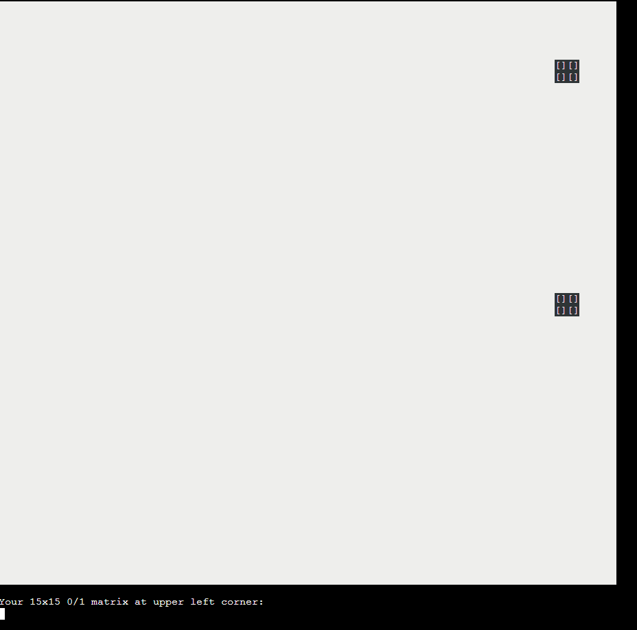
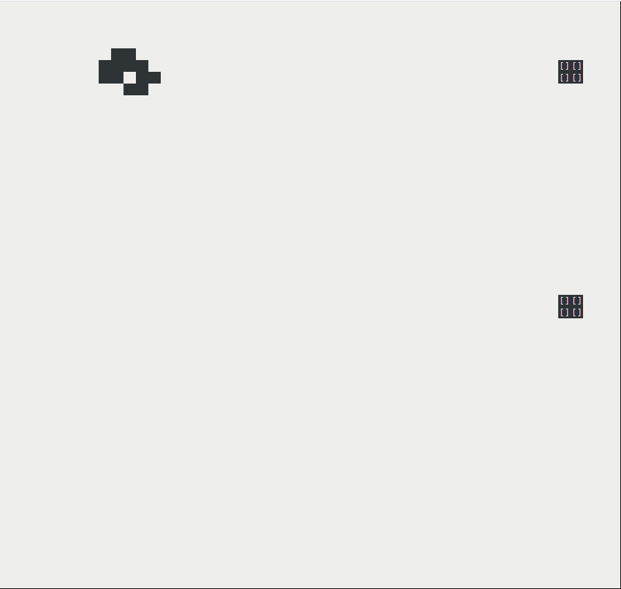
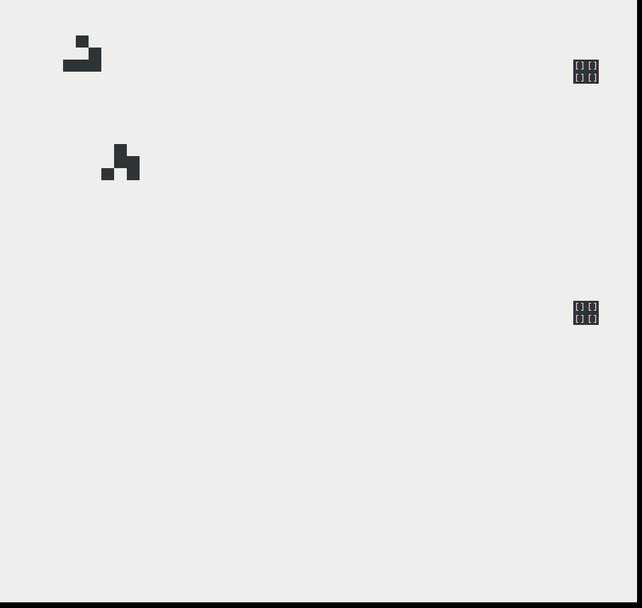
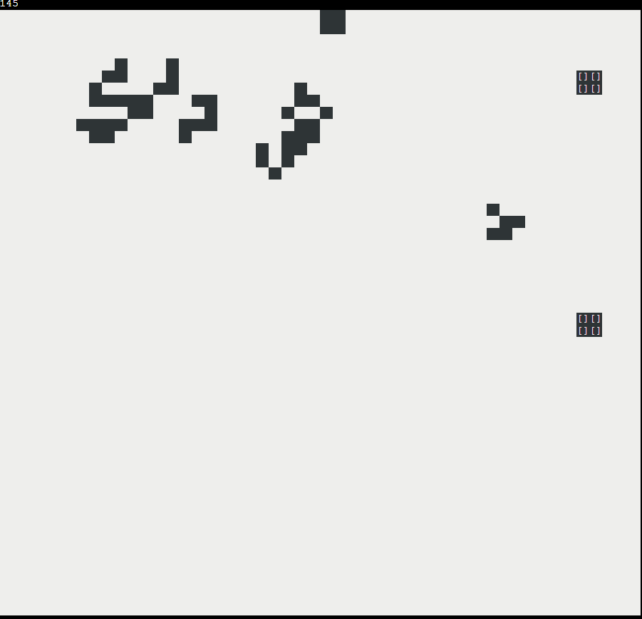
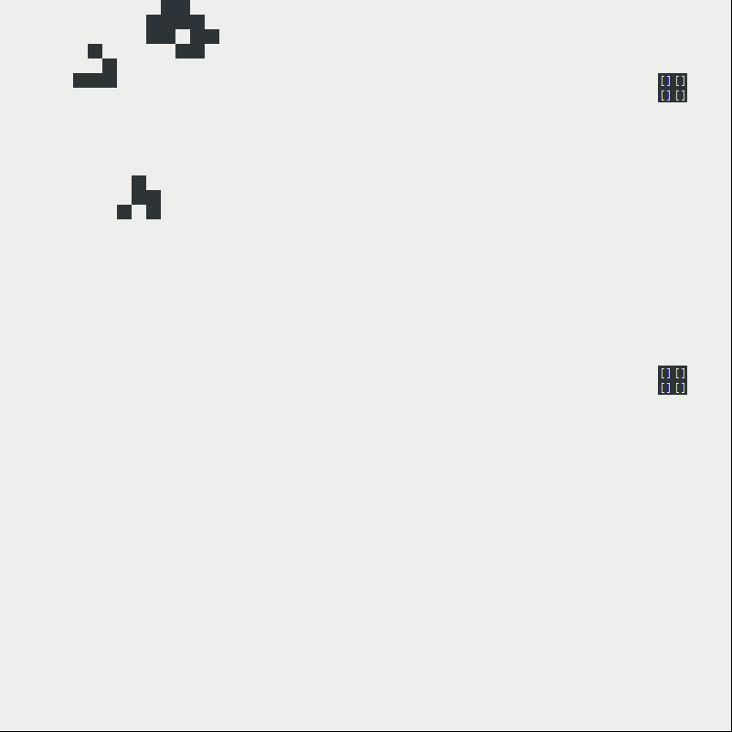

# 超简单的世界模拟器

题面

> 
>
> 以上漫画译自 https://xkcd.com/505/，并以 [Creative Commons Attribution-NonCommercial 2.5 License](http://creativecommons.org/licenses/by-nc/2.5/) 许可证发布。
>
> 你知道生命游戏（Conway's Game of Life）吗？
>
> 你的任务是在生命游戏的世界中，复现出蝴蝶扇动翅膀，引起大洋彼岸风暴的效应。
>
> 通过改变左上角 15x15 的区域，在游戏演化 200 代之后，如果被特殊标注的正方形内的细胞被“清除”，你将会得到对应的 flag：
>
> “清除”任意一个正方形，你将会得到第一个 flag。同时“清除”两个正方形，你将会得到第二个 flag。
>
> 注: 你的输入是 15 行文本，每行由 15 个 0 或者 1 组成，代表该区域的内容。


打开之后长这样：




### flag1

打右上的那个方块是很简单的，去[wikipedia](https://en.wikipedia.org/wiki/Conway%27s_Game_of_Life)里面翻一个spaceship就好了：

```
000000000000000
000000000000000
000000000000000
000000000000000
000000000110000
000000001111000
000000001101100
000000000011000
000000000000000
000000000000000
000000000000000
000000000000000
000000000000000
000000000000000
000000000000000
```



得到flag1：`flag{D0_Y0U_l1k3_g4me_0f_l1fe?_598f026b10}`。


### flag2

可以说是想了我好几天的时间，因为在右上角放置的[Glider](https://upload.wikimedia.org/wikipedia/commons/f/f2/Game_of_life_animated_glider.gif)是会正好擦着右下角的方块过去的。

后来，在某天吃饭的时候想到，可以用碰撞来构建一个混乱的体系，可能可以蹭到右下角的方块。（思路是之前有看到一些spaceship eater）

于是找到了这个页面： https://www.conwaylife.com/wiki/2-glider_collision 。选择右下角的`2-glider mess`尝试了一下。





确实可以生成一个glider撞掉右下的方块。

然后调整一下位置，在右上角~~塞~~加了一个spaceship：

```
000000000001100
000000000011110
000000000011011
000000100000110
000000010000000
000001110000000
000000000000000
000000000000000
000000000000000
000000000000000
000000000000000
000000000000000
000000000100000
000000000110000
000000001010000
```



得到flag2：`flag{1s_th3_e55ence_0f_0ur_un1ver5e_ju5t_c0mputat1on?_4ec7721298}`。