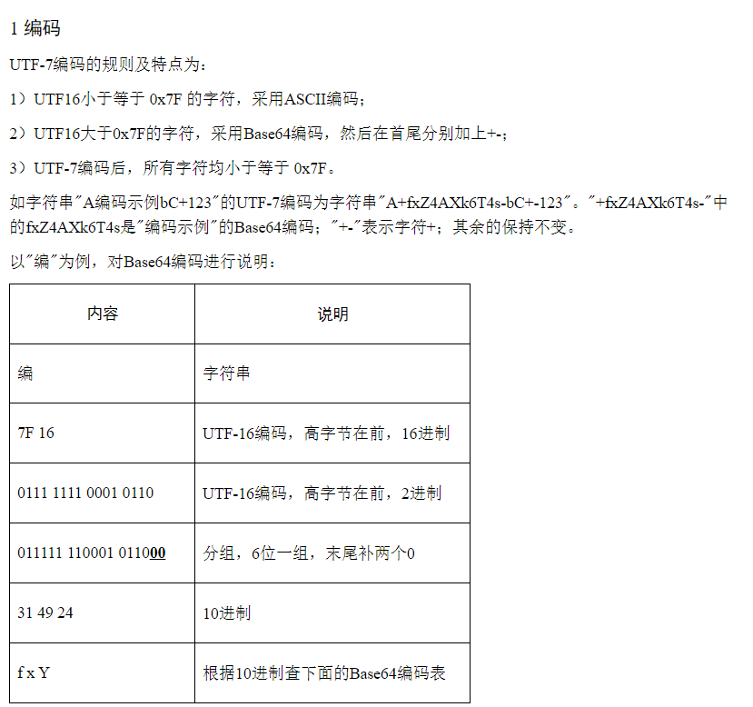

# 233 同学的字符串工具

题面

> 233 同学最近刚刚学会了 Python 的字符串操作，于是写了两个小程序运行在自己的服务器上。这个工具提供两个功能：
>
> - 字符串大写工具
> - UTF-7 到 UTF-8 转换工具
>
> 除了点击下方的打开题目按钮使用网页终端，你也可以通过 `nc 202.38.93.111 10233` 命令连接到 233 同学的服务上。你可以在这里看到 233 同学的源代码: [string_tool.py](https://hack.lug.ustc.edu.cn/media/74a200cb-3449-5707-b7f9-ceb74cb437a6/string_tool.py)。
>
> 如果你不知道 `nc` 是什么，或者在使用上面的命令时遇到了困难，可以参考我们编写的 [萌新入门手册：如何使用 nc/ncat？](https://lug.ustc.edu.cn/planet/2019/09/how-to-use-nc/)
>
> 读了代码之后，你惊讶地发现自己似乎可以通过构造特殊输入，使得 233 同学的工具返回 flag。


### 字符串大写工具

一开始想的是，会不会有特殊字符`upper()`后变成`F` `L` `A` `G`中的一个，于是就写了一段脚本遍历一下：

```python
def main():
    for i in range(1, 65535*10):
        if chr(i).upper() == 'F':
            print(chr(i))
        if chr(i).upper() == 'L':
            print(chr(i))
        if chr(i).upper() == 'A':
            print(chr(i))
        if chr(i).upper() == 'G':
            print(chr(i))
```

结果只有`F` `L` `A` `G` `f` `l` `a` `g`（悲

然后考虑可能有些字符`upper()`之后可能会消失：

```python
def main():
    for i in range(1, 65535*10):
        if len(chr(i).upper()) == 0:
            print(chr(i))
```

结果啥都没有。。。。。。。。。。

然后某天吃饭的时候，反向思考了一下，想到有些字符`upper()`之后可能会变多：

```python
def main():
    for i in range(1, 65535*10):
        if len(chr(i).upper()) == 2:
            print(chr(i), chr(i).upper())
```

结果输出了一大堆！

```
ß SS
ʼn ʼN
ǰ J̌
և ԵՒ
ẖ H̱
ẗ T̈
ẘ W̊
ẙ Y̊
ẚ Aʾ
ὐ Υ̓
ᾀ ἈΙ
ᾁ ἉΙ
ᾂ ἊΙ
ᾃ ἋΙ
ᾄ ἌΙ
ᾅ ἍΙ
ᾆ ἎΙ
ᾇ ἏΙ
ᾈ ἈΙ
ᾉ ἉΙ
ᾊ ἊΙ
ᾋ ἋΙ
ᾌ ἌΙ
ᾍ ἍΙ
ᾎ ἎΙ
ᾏ ἏΙ
ᾐ ἨΙ
ᾑ ἩΙ
ᾒ ἪΙ
ᾓ ἫΙ
ᾔ ἬΙ
ᾕ ἭΙ
ᾖ ἮΙ
ᾗ ἯΙ
ᾘ ἨΙ
ᾙ ἩΙ
ᾚ ἪΙ
ᾛ ἫΙ
ᾜ ἬΙ
ᾝ ἭΙ
ᾞ ἮΙ
ᾟ ἯΙ
ᾠ ὨΙ
ᾡ ὩΙ
ᾢ ὪΙ
ᾣ ὫΙ
ᾤ ὬΙ
ᾥ ὭΙ
ᾦ ὮΙ
ᾧ ὯΙ
ᾨ ὨΙ
ᾩ ὩΙ
ᾪ ὪΙ
ᾫ ὫΙ
ᾬ ὬΙ
ᾭ ὭΙ
ᾮ ὮΙ
ᾯ ὯΙ
ᾲ ᾺΙ
ᾳ ΑΙ
ᾴ ΆΙ
ᾶ Α͂
ᾼ ΑΙ
ῂ ῊΙ
ῃ ΗΙ
ῄ ΉΙ
ῆ Η͂
ῌ ΗΙ
ῖ Ι͂
ῤ Ρ̓
ῦ Υ͂
ῲ ῺΙ
ῳ ΩΙ
ῴ ΏΙ
ῶ Ω͂
ῼ ΩΙ
ff FF
fi FI
fl FL
ſt ST
st ST
ﬓ ՄՆ
ﬔ ՄԵ
ﬕ ՄԻ
ﬖ ՎՆ
ﬗ ՄԽ
```

构造一下字符串`flag`，拿到flag1：`flag{badunic0debadbad_d98e25abf1}`。

### UTF-7 到 UTF-8 转换工具

菜鸡完全不知道啥是utf7，于是去百度了一下（

找到一篇文章： https://www.cnblogs.com/hanford/p/6106322.html

重点看起来是`+-`和Base64



于是先拿`f`试试手：把`f`转base64得到`Zg==`再加`+-`得到`+Zg-`，结果报错。。。。。。。。


想了下可能是太短了位数不够，于是在`f`前补一个`\0`，得到`+AGY-`，试了下work了（


构造字符串`+AGY-+AGw-+AGE-+AGc-`，得到flag2：`flag{please_visit_www.utf8everywhere.org_3d4da6a076}`。

