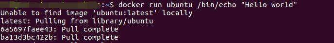
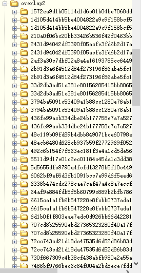
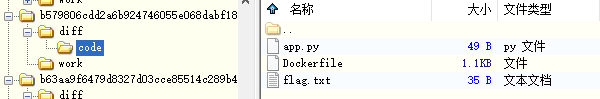
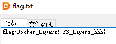

# 233 同学的 Docker

题面

> 233 同学在软工课上学到了 Docker 这种方便的东西，于是给自己的字符串工具项目写了一个 Dockerfile。
>
> 但是 233 同学突然发现它不小心把一个私密文件（`flag.txt`）打包进去了，于是写了一行命令删掉这个文件。
>
> 「既然已经删掉了，应该不会被人找出来吧？」233 想道。
>
> - Docker Hub 地址：[8b8d3c8324c7/stringtool](https://hub.docker.com/r/8b8d3c8324c7/stringtool)


对于一个完全没用过docker的菜鸡来说真的是要命。。。。

先尝试在win10上装docker，结果疯狂报错。。。


没办法只能掏出祖传的VMWare了。。幸好里面还有一个上古的Ubuntu虚拟机，不用再下一个镜像了（

按着[这里的方法](https://www.runoob.com/docker/ubuntu-docker-install.html)安装，在下载的间隙趁机恶补了一下基本理论知识，装完后运行了一下

```bash
docker run ubuntu /bin/echo "Hello world"
```

发现终于成功了。。。



然后拉取image

```bash
docker pull 8b8d3c8324c7/stringtool
```

结果贼慢！！！！！！！！还失败了好几次！！！！！！！！！

百度了一下，按[这里的方法](https://www.cnblogs.com/spll/p/11828193.html)换到了阿里云的mirror，瞬间就下好了（泪目

在 https://hub.docker.com/layers/8b8d3c8324c7/stringtool/latest/images/sha256-aef87a00ad7a4e240e4b475ea265d3818c694034c26ec227d8d4f445f3d93152?context=explore 翻了一下，是用`rm`删的，路径是`/code/flag.txt`。

查了一下资料，说是docker会用`layer`储存每一次的更改。那么就应该有`diff`文件了（

然后用 DiskGenius 翻了下虚拟机的磁盘img文件，在`/var/lib`里找到了一个叫`docker`的文件夹。继续翻，在`root/var/lib/docker/overlay2`里找到一堆哈希值的文件夹。（有git内味了



一个个点开看，找`diff`文件夹里有没有`code`子文件夹。





找到flag：`flag{Docker_Layers!=PS_Layers_hhh}`。（这个flag过于草