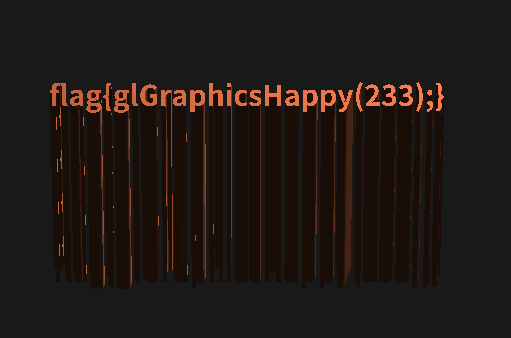

# 超简陋的 OpenGL 小程序

题面

> 年轻人的第一个 OpenGL 小程序。
>
> （嗯，有什么被挡住了？）


打开之后长这样：


删了`basic_lighting.vs`或`basic_lighting.fs`，程序报错，但还是只能看到一点：


去百度了一下，有说：

> vs是处理顶点的. fs是处理像素的

发现`basic_lighting.vs`里面有个变量叫做`view`，感觉可以稍微玩♂弄一下。

```OpenGL Shading Language
uniform mat4 view;
```

百度查到这些文件的语言为`OpenGL Shading Language`，`mat4`代表四维矩阵，于是构造了一个新`mat4`变量去微扰`view`：

```OpenGL Shading Language
mat4 a = mat4(0., 0., 0., 0., 0., 0., 0., 0., 0., 0., 0., 0., 0., 0., 0., 0.);
```

同时将

```OpenGL Shading Language
gl_Position = projection * view * vec4(FragPos, 1.0);
```

改为

```OpenGL Shading Language
gl_Position = projection * (view + a) * vec4(FragPos, 1.0);
```

乱试了一下，发现`a`取`mat4(0., 0., 0., 0., 0., 0., 0., 0., 0., 11., 0., 0., 0., 0., 0., 0.)`的时候，可以看到flag。



得到flag：`flag{glGraphicsHappy(233);}`。