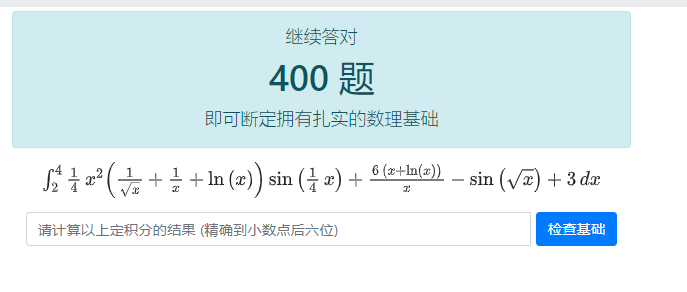
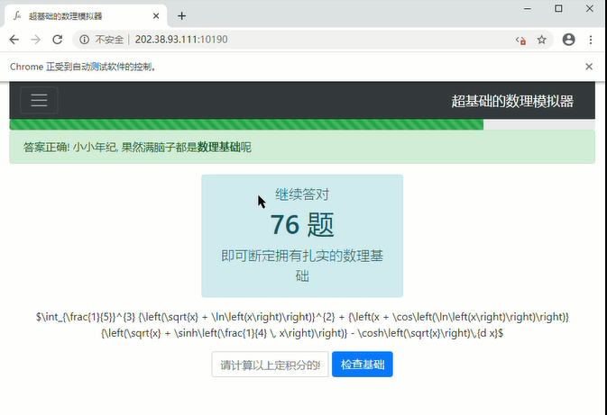
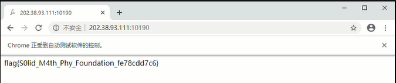

# 超基础的数理模拟器

题面

> 这一切的一切，还要从 Hackergame 2020 群说起。
>
> 不知是从什么时候，也许是上一次 Hackergame，或是更早，Hackergame 2020 群里的科气逐渐变得浓厚起来。 等到真正引起管理员注意时，上千人的群已经完全沦为了菜市场。 群里充斥着各式各样的卖菜声，比如 "tql"，"wtcl"，"sdl, wsl"，"orz"，"ddw"，各式各样的卖弱表情包交相辉映。 再加上群内复读机和正常人的比例严重失调，致使事态进一步恶化，场面一度无法控制。
>
> 在管理员和其余正常群友的齐心协力之下，此类现象在群内的出现频率最终显著下降。 但不幸的是，由于其他群的群主警惕不足，或是管理不慎(某大群群主甚至大肆宣扬 "科气 is fake"，听说最近连自己也未能幸免科了起来，也不知还能不能继续当选下一任群主)，每天仍然有许多群友在花式卖弱，而一些心理素质较差的群友也因此永远地退出了群聊。
>
> 各大水群的诸多龙王联合起来，研究多月之后，终于找到了此次事件的罪魁祸首: 那位身处大洋彼岸，就读于 UCB，不可提及姓名的老学长。而他的根本目的，就是试图利用同学们充满科气的卖弱行为，在如今废理兴工已经式微的科大，再次掀起反思数理基础教育的思想浪潮。 故而本次事件被命名为: FLXG-20。
>
> 为了应对那位学长的所作所为，我们在 Hackergame 2020 的网站上部署了一项超基础的数理模拟器。 作为一名数理基础扎实的同学，你一定能够轻松通过模拟器的测试吧。


点进去长这样：



太卷了！！！！！！！！！！！！！！！！！！


用CASIO手算了两题，实在扛不住（

于是打算用Selenium + Wolfram Mathematica整活，由于Wolfram Mathematica只支持Wolfram Script语言，所以先要把Latex转换一下。


### Latex to Wolfram Script

积分的上下界比较好弄，只有整数和分数两种情况：

```python
def format_num(s):
    return re.sub(r'\\frac\{([\d|x]*)\}\{([\d|x]*)\}', r'\1/\2', s)
```

函数就麻烦了，需要检查各种括号，正则表达式没法很好地搞定，但是也没有解决办法，想着刷新也不掉分，那就roll吧（

```python
def format_func(s):
    rst = s
    rst = re.sub(r'\\,', r' ', rst)  # 分隔
    rst = re.sub(r'\^\{([\d|x]*)\}', r'^(\1)', rst)  # 幂
    rst = re.sub(r'\\sqrt\{([\d|x]*)\}', r'Sqrt[\1]', rst)  # 开方
    rst = re.sub(r'\\ln\\left\((.*?)\\right\)', r'Log[\1]', rst)  # 对数
    rst = re.sub(r'\\s(inh?)\\left\((.*?)\\right\)',
                 r'S\1(\2)', rst)  # sin sinh
    rst = re.sub(r'\\c(osh?)\\left\((.*?)\\right\)',
                 r'C\1(\2)', rst)  # cos cosh
    rst = re.sub(r'\\tan\\left\((.*?)\\right\)', r'Tan(\1)', rst)  # tan
    rst = re.sub(r'\\arctan\\left\((.*?)\\right\)',
                 r'Arctan(\1)', rst)  # arctan
    rst = re.sub(r'\\frac\{(.*?)\}\{(.*?)\}', r'((\1)/(\2))', rst)  # 分数
    rst = re.sub(r'\\(?:(?:left)|(?:right))', r'', rst)
    rst = re.sub(r'e', r'E', rst)
    return rst
```


### 爬表达式

Selenium真是太好用了，直接禁用js就能拿到Latex表达式。然后就用`os.popen()`扔Mathematica里，报错就刷新roll下一道（

运行中长这样：



跑了一个半小时，最后拿到flag：`flag{S0lid_M4th_Phy_Foundation_fe78cdd7c6}`。



