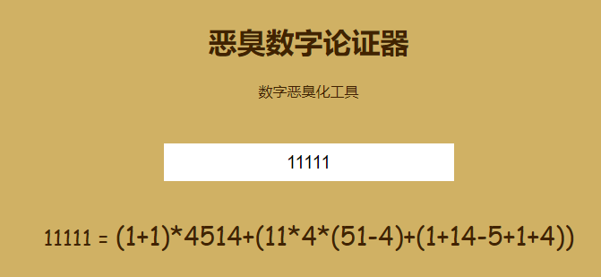
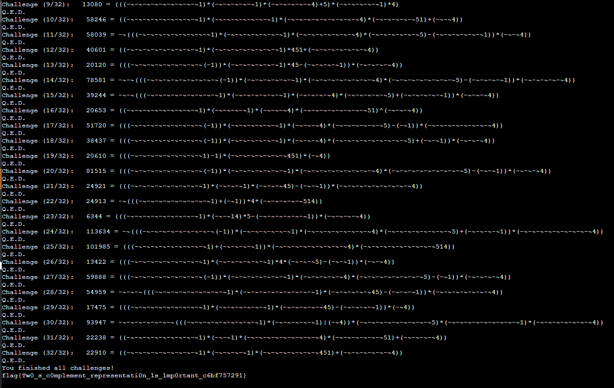

# 超精巧的数字论证器

题面：

> 数字论证是一种常见的定理证明方法。简单来说，就是对于给定的自然数，找出一个等值的表达式，如果该表达式去除所有符号部分后为字符串「114514」，则完成论证。表达式仅允许整数运算，可以使用括号、常见的代数运算符 `+-*/%` 和位运算符 `~^&|`。表达式具体运算规则与 Python 2 语言类似。
>
> 一些数字论证的例子：
>
> ```
> 0 = (1/14514)
> 1 = (1%14514)
> 2 = (11&4514)
> 3 = (1+(14&514))
> 4 = (1^(145%14))
> 5 = -(1145|-14)
> 6 = (-1145&14)
> 7 = (11-(4%514))
> 8 = (1145&14)
> 9 = -(-11|4514)
> 10 = (11&-4514)
> 11 = (11%4514)
> 12 = (11-(45|-14))
> 13 = (-1+(14%514))
> 14 = (1*(14%514))
> 15 = (1+(14%514))
> 16 = (1+(14|(5%14)))
> 17 = ((11&-45)+14)
> 18 = (114&(5+14))
> 19 = (1+(14+(5&14)))
> ```
>
> 数字论证并不是一件容易的事情，你可以完成这个任务吗？
>
> 给定的自然数保证小于 114514。输入的表达式长度不可以超过 256 字符。
>
> 除了网页终端，你也可以通过 `nc 202.38.93.111 10241` 来连接

臭味，喷了出来。


于是立即面向baidu+google编程，发现了一个现成的恶臭验证器： https://lab.magiconch.com/homo/ ，但是效果不好。因为不使用位运算，有时会出现复数个114514相加的情况：



这显然是不符合要求的。（倒是学到了要**打表**）

~~看起来只能自己写了5555~~


### =============================分割线===================================


然后在某天晚上组会前的半个小时，坐在一楼大厅把程序规划了一下~~（结果最后组会取消了但是这不重要）~~：

### 插空

按插空位置，生成一个`2**(len('114514') - 1)`长度的列表。

```python
def divide(s):
    if len(s) == 2:
        return [[s], [s[0], s[1]]]
    elif len(s) > 2:
        s_end = s[-1]
        rst = []
        for item in divide(s[:-1]):
            _0 = item.copy()
            _1 = item.copy()
            _0[-1] += s_end
            _1.append(s_end)
            rst.append(_0)
            rst.append(_1)
        return rst
    else:
        return []
```

~~写了个递归，我真的很努力了555555~~

大概就是对于每一位，可以与前一位合并（不插空），或分开（插空）。

然后转int：

```python
def str2int(str_list):
    int_list = []
    for str_item in str_list:
        int_item = []
        for s in str_item:
            int_item.append(int(s))
        int_list.append(int_item)
    return int_list
```

### 运算符

一个关于运算符的struct（除法有小数，大手一挥不要了）：

```python
class Operation():
    operators = ['%', '*', '+', '-', '&', '|', '^']
    priority = {
        '~': 10,
        '%': 9,
        '*': 9,
        '+': 8,
        '-': 8,
        '&': 7,
        '|': 6,
        '^': 6
    }
    operate = {
        '~': lambda n: ~n,
        '%': lambda a, b: a % b,
        '*': lambda a, b: a * b,
        '-': lambda a, b: a - b,
        '+': lambda a, b: a + b,
        '&': lambda a, b: a & b,
        '|': lambda a, b: a | b,
        '^': lambda a, b: a ^ b
    }

    def __init__(self):
        pass
```

### 构造表达式、计算

这是比较重点的地方：

**`-~i`和`i+1`是等价的，所以可以对每一块数字用`-~`进行微调。**

因此引入了微扰`perturbation`~~（分子轨道的一个术语，将就着用一下）~~，用来确定`-~`的个数。

```python
class Expression():
    def __init__(self, val: int, perturbation: int = 0):
        self.val = val + perturbation
        if val >= 0:
            self.opr = '+'
            self.exp = str(val)
        else:
            self.opr = '-'
            self.exp = '(' + str(val) + ')'
        if perturbation:
            self.exp = '(' + '-~' * perturbation + self.exp + ')'
        self.priority = 10

    def add_node(self, opr: str, rval: int, perturbation: int = 0):
        self.val = Operation.operate[opr](self.val, rval + perturbation)
        if Operation.priority[opr] > self.priority:
            self.exp = '(' + self.exp + ')'
        if perturbation:
            rexp = '(' + '-~' * perturbation + str(rval) + ')'
        else:
            rexp = str(rval)
        self.exp = self.exp + opr + rexp
        self.opr = opr
        self.priority = Operation.priority[opr]

    def get_exp(self):
        return self.exp
```

### 遍历运算符

```python
class Expressions():
    def __init__(self, val: int):
        self.expressions = {}
        for perturbation in range(0, MAX_PERTURBATION + 1):
            self.expressions[val] = Expression(val, perturbation)
            self.expressions[-val] = Expression(-val, perturbation)

    def add_num(self, rval: int):
        new_expressions = {}
        for lval, expression in self.expressions.items():
            for opr in Operation.operators:
                for perturbation in range(0, MAX_PERTURBATION + 1):
                    _ = copy.copy(expression)
                    _.add_node(opr, rval, perturbation)
                    if _.val not in new_expressions or len(new_expressions[_.val].get_exp()) > len(_.get_exp()):
                        new_expressions[_.val] = _
        self.expressions = new_expressions

    def output(self):
        out = {}
        for val, expression in self.expressions.items():
            if val not in out or len(out[val]) > len(expression.get_exp()):
                out[val] = expression.get_exp()
        return out
```

一个很重要的优化是在每一轮运算符的遍历之后，相同的`val`指保留长度最短的。

~~（没优化之前把我16G的RAM吃光了，对就是MemoryError）~~

### 最后

设置一下`MAX_PERTURBATION`就能开跑了。设置为`9`的时候，生成时间大概在30 s，已经够解题了。打出来的表存在`homo.txt`，手动`Ctrl+F`或者写个查询脚本都可以。



得到flag：`flag{Tw0_s_c0mplement_representati0n_1s_1mp0rtant_c6bf757291}`。

~~其实可以用pwntools的，但是我的虚拟机一直解析不了服务器地址（真奇怪~~