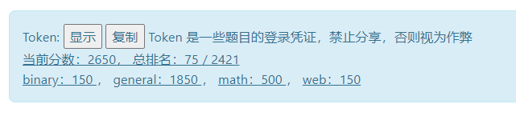

# hackergame2020-writeups
记录一个零cs基础的化学苟的解题思路（所以解法都比较直球）

我爬我爬.jpg

最终排名75/2421

另附：

比赛地址：https://hack.lug.ustc.edu.cn/

官解地址：https://github.com/USTC-Hackergame/hackergame2020-writeups

~~顺带爬了一份参赛选手名单：[users.json](users.json)~~

然后又爬了一下每个选手的分数（

感觉可以用来分析一下（~~在做了在做了~~

